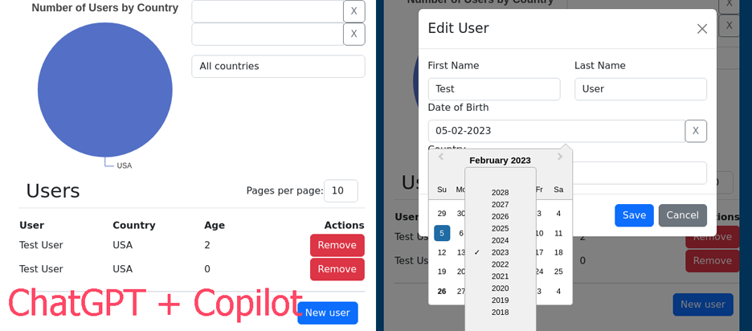

# User Country Analytics

## Very brief project overview

During this project, I had learn the basics of Laravel and Redux (in ReactJS) while simultaneously exploring the capabilities of AI and its potential to help people with disabilities. The focus was on using AI assistants (ChatGPT and Copilot) to aid in the development process. In contrast to other similar projects, special attention was paid to code maintainability and testability. The final version of the project included over 30 tests for the backend and over 50 tests for the frontend. The goal was not only to create an application but also to ensure that the code could be easily maintained and extended in the future.

Effective collaboration between humans and AI was also a key consideration in the project. While AI can augment our abilities and help us overcome limitations, it cannot replace the need for expert knowledge and experience. The project highlighted the importance of balancing AI's potential with human expertise to achieve the best outcomes.

Overall, the project demonstrated the potential for AI to revolutionize the way people with disabilities work and interact with the world around them. While there are still challenges to overcome, the benefits of using AI to augment our abilities are significant and undeniable. With continued exploration and development, AI has the potential to transform the lives of people with disabilities and improve accessibility for all.

---

Initial project description:

> Create a simple php application using the laravel framework, a mysql database and the React JS framework on the frontend. If you are familiar with that, create it as a Single Page Applications. So the backend will be pure REST API and frontend will be compiled static javascript, which communicates with backend API only via ajax requsts. 
> 
> The application will work with two DB tables, one containing users, the other containing countries.
> 
> Users will have a first name, last name, date of birth and relation to the country. Country contains only id and name.
> 
> On the home page, display a "pie chart" from the library https://echarts.apache.org/, whose parts will mean country and the value will be the number of users in that country.
> 
> To the right of the graph, display two inputs that will serve as a date filter for the range of dates from - to, which will be applied to the date of birth. Choose a suitable plugin for datepicker and apply it to the inputs. After selecting the dates, this filter will be automatically apply to the graph and will only display users whose birth dates fall within the specified range. This filter should be sent as a parameter to the backend where it is applied.
> 
> Below the graph, display the list of filtered users, choose the appropriate react component on data grid in which users will be displayed. After clicking on the grid line, display a popup window, which will display the user details in the form. Confirm the form to edit the user on the backend and apply the change to both the table and the chart. Allow adding and deleting users.
> 
> When you are done, please test the application and check the edge cases if you are didn't miss any usecase. Feel free to display any notifications or warnings, if you think it's needed. 
> 
> Deploy the finished result to a publicly available repository.

The project started with a minimal experience in Laravel and React/Redux, but with a general idea of the desired outcome and code quality. I added to the project's requirements the presence of tests and maximizing the use of AI in development. Despite using AI assistants like ChatGPT and Copilot, the ecosystem of Laravel and React/Redux turned out to be more challenging than expected, leading to the need to fix many things to follow best practices. The experience was valuable and it highlighted that while AI can significantly increase productivity, it cannot replace the need for expert knowledge and experience if you are pushing the limits and don't accept low-quality results. 

All AI-related data (conversations with ChatGPT) are in the [AI Backlog](AI%20Backlog) folder.

Read also my [notes about disability & AI](disability_and_AI.md).
